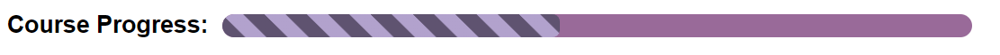

# Custom Styled Progress Bar

A custom-styled progress bar created using HTML and CSS to visually track course progress or similar tracking applications.

## Description

This project showcases how to create a unique and visually appealing progress bar with custom styles. The progress bar can be used to represent the completion status of a course or any tracking application. It includes both Webkit (Chrome, Safari, Edge) and Mozilla (Firefox) compatibility to ensure a consistent appearance across different web browsers.

## Usage

To use this custom-styled progress bar in your web project:

1. Clone this repository or download the source code.
2. Include the `styles.css` file in your project.
3. Add the HTML structure for the progress bar as demonstrated in the `index.html` file.
4. Customize the progress bar's appearance by modifying the CSS styles to suit your project's design.

## Features

- Custom gradient background for a unique appearance.
- Rounded borders for a modern and clean look.
- Cross-browser compatibility for Webkit and Mozilla browsers.
- Easily customizable to fit your project's design requirements.

## License

This project is licensed under the **GNU General Public License v3.0**. See the [GNU General Public License v3.0
](LICENSE) file for details.

## Acknowledgments

- Inspired by the need for visually appealing progress tracking.
- Built with HTML and CSS.

Feel free to modify and use this progress bar in your projects. If you find this project helpful, consider giving it a star and sharing it with others!
